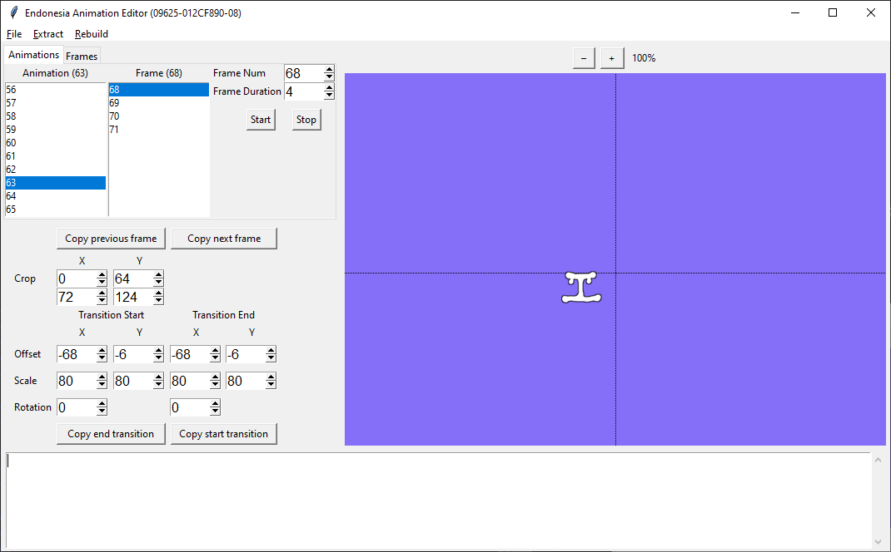
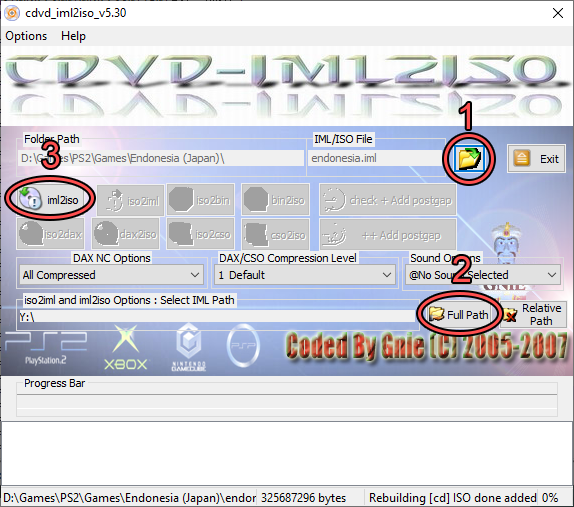

# Endonesia Tool<!-- omit from toc -->

A tool for packing and unpacking PS2 Endonesia resources.

This tool does not provide the ISO for this game. It will not be provided for you, so please don't ask about it.

### Table of Contents<!-- omit from toc -->

- [Requirements](#requirements)
- [Setup](#setup)
- [Usage](#usage)
- [1. Font](#1-font)
  - [Font Extraction](#font-extraction)
  - [Font Editing](#font-editing)
  - [Font Rebuilding](#font-rebuilding)
- [2. Script](#2-script)
  - [Script Extraction](#script-extraction)
  - [Script Editing](#script-editing)
  - [Script Rebuilding](#script-rebuilding)
- [3. Images and Animations](#3-images-and-animations)
  - [Image and Animation Extraction](#image-and-animation-extraction)
  - [Image Editing](#image-editing)
  - [Animation Editing](#animation-editing)
    - [Parameters](#parameters)
    - [Buttons](#buttons)
  - [Image and Animation Rebuilding](#image-and-animation-rebuilding)
- [4. Rebuild ISO](#4-rebuild-iso)
  - [Image Formats](#image-formats)
  - [Text Formats](#text-formats)
  - [Credit](#credit)

# Requirements

- [Python 3](https://www.python.org/downloads/)
- [Armips](https://github.com/Kingcom/armips/releases)
- [cdvd2iml5.30](https://mega.nz/file/TzhihCjJ#5JCb_DNUklakDtO1t99ZOY0AI_XWXKUiI2BfZhmvjow)
- Mounted/extracted files from the game ISO

# Setup
- Install Python 3
- Get this repository. You can either [download and extract it as a ZIP file](https://github.com/arsym-dev/endonesia-tool/archive/refs/heads/master.zip) or run the following command
```bash
git clone https://github.com/arsym-dev/endonesia-tool.git
```
- Open a terminal in the folder containing this project. On Windows, this can be done quickly by pressing Shift + Right Click inside the folder, then pressing "Open PowerShell window here"
- Inside the terminal, run the following:
```bash
python -m pip install pillow
```

At this point test that everything is working correctly by running:
```bash
python gui.py
```

- Extract the files from the Endonesia disc image into a folder (it does not have to be in this directory).
  - If you have an ISO file then you can extract files from it as if it is a ZIP file.
  - If you have a CUE/BIN file, you can first convert the BIN to ISO then extract. There are also tools that can extract from a BIN image directly.
- In order to prevent accidentally overwriting your progress, it is recommended that you create backups of the ELF and EXO.BIN files. **It is suggested that you rename your files to `SLPM_620.47.bak` and `EXO.BIN.bak`** as these are the file names used in the following commands.

# Usage

Open a console terminal in the root directory of this project. Run:

```bash
python gui.py
```

# 1. Font
## Font Extraction

| Program  | Command |
| -------- | ------- |
| GUI      | Press `Extract > Extract Font` |
| Terminal | <pre>python endonesia-tool.py font-extract -e /path/to/SLPM_620.47.bak -f extracted_font.bmp</pre> |

This will extract a BMP file in the same directory as the tool.

## Font Editing
Using an image editing program, edit the extracted BMP file. Each character is in a 24x24 tile.

Once you're done editing the image, you may save it as either a BMP or PNG image. For convenience, a modified version of the font has been provided in `assets/font_en.png` which has already been modified to use variable font width for English characters.

## Font Rebuilding
IMPORTANT: Make sure that you have downloaded and extracted [`armips.exe`](https://github.com/Kingcom/armips/releases) into the root of the repository. `armips` is needed to make use of the font width table.

| Program  | Command |
| -------- | ------- |
| GUI      | Press `Rebuild > Rebuild Font` |
| Terminal | <pre>python endonesia-tool.py font-rebuild -f assets/font_en.png -v assets/font_widths.json -ei /path/to/SLPM_620.47.bak -eo /path/to/SLPM_620_font.47</pre> |

The above command will repack the ELF file with the supplied English font (`assets/font_en.png`) and variable width file (`assets/font_widths.json`). Because of the way `armips` works, it assumes the ELF file you're trying to change is called `SLPM_620_font.47`. If you'd like to change it to a different file name, you will have to change this in the first line in `tools/vfw.asm`.

The more general form of this command is:

```bash
python endonesia-tool.py font-rebuild -f path/to/input_font.bmp -ei /path/to/SLPM_620.47.bak -eo /path/to/SLPM_620_font.47
```

The above command will create a fixed width font. That means all characters will have a width of exactly 24 pixels. While this works for fixed-width fonts such as most Japanese and Chinese fonts, it does not look good with variable width languages such as most English fonts.

To fix this, provide a JSON file containing the widths of each character. The JSON file has the following format:

```
{
    "[char]": [pixel width],
    "[another char]": [pixel width],
    ...
}
```

# 2. Script
## Script Extraction
| Program  | Command |
| -------- | ------- |
| GUI      | Press `Extract > Extract Script` |
| Terminal | <pre>python endonesia-tool.py script-extract -e /path/to/SLPM_620.47.bak -x /path/to/EXO.BIN.bak -c script_extracted.csv</pre> |

If you want to overwrite the existing CSV file, use the `-r` flag.

It is suggested to rename the CSV file when editing it to prevent accidentally overwriting it if this command is run again.

## Script Editing

Open the CSV file in a text editor. The CSV has the following format:

| File | ELF Pointer | EXO Block | Text addr | Item num | JP text          | EN text |
| ---- | ----------- | --------- | --------- | -------- | ------- |
| ELF  | 003094c0    | 0         | 00348318  | 2        | 例の少年について |         |

- Your final translated text must appear after the final pipe character (`|`).
- If a line does not contain any text after the final pipe, the original Japanese will be used.
- Editing the JP text column does nothing. Only text in the EN text column will affect the game
- If a row is missing from the CSV, the original Japanese will be used and the file will still rebuild nicely. You can use this to get rid of debug text from your edited CSV file without affecting the game.
- `\\n` signifies a new line
- Hexcode between curly brackets `{}` is used for special characters. Notably `{256E}` is the code that represents the player's name.

## Script Rebuilding

It is suggested to rebuild the font first in a separate file (`SLPM_620_font.47`) and use that file as the input for this process.

| Program  | Command |
| -------- | ------- |
| GUI      | Press `Rebuild > Rebuild Script` |
| Terminal | <pre>python endonesia-tool.py script-rebuild -c /path/to/edited_script.csv -ei /path/to/SLPM_620_font.47 -eo /path/to/SLPM_620.47 -xi /path/to/EXO.BIN.bak -xo /path/to/EXO.BIN</pre> |

# 3. Images and Animations
## Image and Animation Extraction
| Program  | Command  |
| -------- | ------- |
| GUI      | Press `Extract > Extract Images` |
| Terminal | <pre>python endonesia-tool.py image-extract -x /path/to/EXO.BIN.bak -o /path/to/image/directory -c script_extracted.csv</pre> |

## Image Editing
Using an image editing program, edit the extracted BMP file.

## Animation Editing
Animation data is stored within JSON files.

1. In the GUI, press `File > Open Animation JSON` or press `Ctrl + O`.
2. You will be presented with a bunch of PNG files. Selecting one will automatically load the corresponding JSON.
3. Make changes to the desired animations
4. Press `File > Save Animation JSON` or press `Ctrl + S`.

<p align="center">

</p>

Each frame of animation has a "Start" state and an "End" state. If the two states are the same, then the frame will be a single static image. If the states differ, then the cropped region will transition (linear interpolation) from the start state to the end state. This can be used to create smooth rotations, sliding animations, and so on.

### Parameters
| Parameter | Description |
| --------- | ----------- |
| Frame Num | The index for the current frame of animation. |
| Frame Duration | How long the current frame will be displayed. The game runs at 30fps, so one tick of duration is 33.3 milliseconds.
| Crop | The top left and bottom right coordinates that define the crop rectangle of the current frame
| Offset | Offset to apply to the cropped region. This moves the image in-game. The center of the dotted black lines indicates the origin (0, 0) |
| Scale | How much to scale the cropped region. 100% by default.
| Rotation | Rotation in degrees to apply to the cropped region

### Buttons
| Button | Description |
| ------ | ----------- |
| Start | Start the animation |
| Stop | Stop the animation |
| Copy previous frame | Copy all values from the preceding frame (including crop and start/end states) |
| Copy next frame | Copy all values from the following frame (including crop and start/end states) |
| Copy end transition | Copy the values of the ending state into the starting state (offset, scale, rotation) |
| Copy start transition | Copy the values of the starting state into the ending state (offset, scale, rotation) |

## Image and Animation Rebuilding
| Program  | Command |
| -------- | ------- |
| GUI      | Press `Rebuild > Rebuild Images` |
| Terminal | <pre>python endonesia-tool.py image-rebuild -i /path/to/image/directory -xi /path/to/EXO.BIN.bak -xo /path/to/EXO.BIN</pre> |


# 4. Rebuild ISO
You will need cdvd2iml5.30 to create the ISO. You can download it from here:

[PlayStation_2_Mastering_tools_Collection-v1.7z](https://mega.nz/file/TzhihCjJ#5JCb_DNUklakDtO1t99ZOY0AI_XWXKUiI2BfZhmvjow)

Run `cdvd2iml5.30.msi` and install it. Once it's installed, run it from the start menu.

<p align="center">

</p>

1. Move the files `endonesia.iml` and `endonesia.ims` from the `assets/` folder and put them in your game folder
2. Use the program to open `endonesia.iml` in your game folder
3. At the bottom, press "Full Path" and navigate the folder that has the folder with the extracted Endonesia files
4. Press the "iml2iso" button

Once you've done this, you should have a "endonesia.iso" file that you can use

## Image Formats

Since the binary data in this game most closely resembles BMP, we will be using indexed 4-bit and 8-bit BMP images for sprites. It is recommended to stay in indexed mode, and not to change the palettes or their order, but this tool attempts to closely match the data and formats used in the game upon packing.

## Text Formats

Text is saved with the EUC-JP encoding.

## Credit

Built on beelzy's repository from GitLab

- https://gitlab.com/beelzy/endonesia-tool
